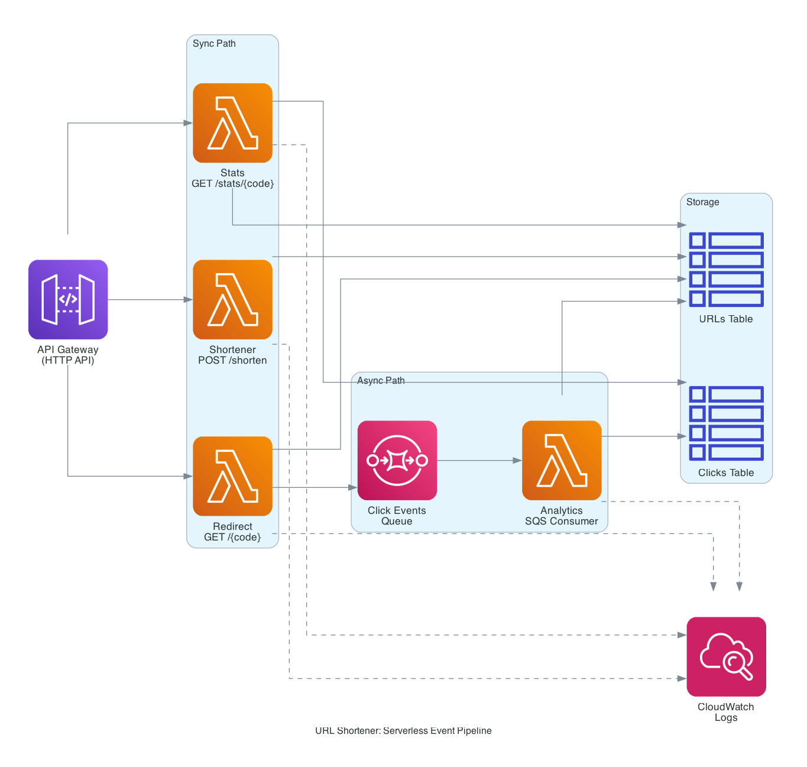

# Serverless Event-Driven Data Pipeline

A production-realistic serverless event pipeline built on AWS Lambda, API Gateway, DynamoDB, and SQS. The use case is a URL shortener with click analytics, but the architecture pattern applies to any event-driven system, payment processing, analytics ingestion, IoT pipelines, order processing, audit logging.

Fully managed, zero servers, pay-per-request. Deploys in under 2 minutes with Terraform.



## What This Project Demonstrates

- **Event-driven architecture**: API ingestion → async queue → background processing → data storage → analytics queries
- **Lambda functions**: 4 Python 3.12 functions with shared code, structured logging, and proper error handling
- **API Gateway HTTP API v2**: REST endpoints with path parameters, CORS, access logging (cheaper than REST API)
- **DynamoDB**: 2 tables with Global Secondary Index, conditional writes, atomic counters
- **SQS with Dead Letter Queue**: 3-retry redrive policy, long polling, partial batch failure support
- **IAM least-privilege**: Separate role per Lambda with minimal permissions
- **Reusable Terraform modules**: 4 modules (lambda, dynamodb, sqs, api_gateway) composed into a complete stack
- **CloudWatch logging**: Structured JSON logs with 14-day retention

## Architecture

```
┌─────────────────────────────────────────────────────────────────┐
│                         API Gateway                             │
│              (HTTP API v2, CORS, access logs)                   │
└────────┬──────────────────┬──────────────────────┬──────────────┘
         │                  │                      │
    POST /shorten      GET /{code}           GET /stats/{code}
         │                  │                      │
         ↓                  ↓                      ↓
   ┌──────────┐        ┌──────────┐          ┌──────────┐
   │ Lambda   │        │  Lambda  │          │  Lambda  │
   │ shortener│        │ redirect │          │  stats   │
   └────┬─────┘        └────┬─────┘          └────┬─────┘
        │                   │                     │
        │ PutItem           │ GetItem             │ GetItem + Query
        │                   │                     │
        ↓                   ↓                     ↓
   ┌─────────────────────────────────────────────────┐
   │                 DynamoDB                         │
   │  ┌─────────────┐        ┌──────────────────┐   │
   │  │ urls table  │        │  clicks table    │   │
   │  │  PK: code   │        │  PK: code        │   │
   │  │  url        │        │  SK: click_id    │   │
   │  │  clicks     │        │  GSI: timestamp  │   │
   │  └─────────────┘        └──────────────────┘   │
   └─────────────────────────────────────────────────┘
                              ↑
                              │ PutItem + UpdateItem
                              │
                         ┌────────────┐
                         │  Lambda    │
                         │ analytics  │ ← SQS trigger (batch of 10)
                         └────────────┘
                              ↑
                              │ ReceiveMessage
                              │
                         ┌──────────────┐
                         │  SQS Queue   │
                         │  (clicks)    │
                         └──────┬───────┘
                                │ failed x3
                                ↓
                         ┌──────────────┐
                         │     DLQ      │
                         │ (clicks-dlq) │
                         └──────────────┘
                              ↑
                              │ SendMessage
                              │
                         (redirect Lambda)
```

## The Flow, End-to-End

1. **User shortens a URL**: `POST /shorten` with `{"url": "https://..."}`. The shortener Lambda generates a 7-character code, stores it in DynamoDB with a conditional write (`attribute_not_exists`) to prevent collisions, and returns the short URL.

2. **User clicks the short link**: `GET /{code}`. The redirect Lambda reads the URL from DynamoDB, fire-and-forget sends a click event to SQS (doesn't wait for confirmation), and returns a 302 redirect. Response time stays under 100ms.

3. **SQS triggers analytics processing**: The analytics Lambda receives batches of up to 10 click events. For each click, it writes a detail record to the clicks table and atomically increments the click counter on the urls table. If 3 of 10 messages fail, only those 3 go back to the queue (partial batch failure).

4. **Failed messages go to DLQ**: After 3 failed retries, messages move to a dead letter queue where they're preserved for 14 days for debugging.

5. **User checks stats**: `GET /stats/{code}`. The stats Lambda reads metadata from the urls table, queries recent clicks from the clicks table (using the `timestamp-index` GSI), aggregates top user agents and referers, and returns JSON.

## Why This Architecture

**Async decoupling via SQS**: The redirect Lambda doesn't wait for analytics processing. Whether analytics takes 10ms or 10 seconds, users get their 302 redirect immediately. This is the key pattern for keeping user-facing endpoints fast.

**DynamoDB atomic counters**: Using `UpdateExpression: "ADD clicks :inc"` is atomic at the database level — no read-modify-write race conditions, even with high concurrency.

**Conditional writes for collision handling**: The shortener uses `ConditionExpression: "attribute_not_exists(code)"` so two simultaneous requests generating the same random code can't both succeed. On collision, we retry with a new code.

**Partial batch failure**: When SQS triggers Lambda with 10 messages and 3 fail, only those 3 go back to the queue. Most tutorials fail the entire batch, which wastes compute and delays successful messages.

**Dead Letter Queue**: Failed messages don't block the main queue. After 3 retries, they move to the DLQ where you can investigate without impacting the pipeline.

**Least-privilege IAM**: Each Lambda has its own role with the minimum permissions it needs. The shortener can only PutItem on urls. The redirect can only GetItem on urls + SendMessage to SQS. Security best practice.

## Project Structure

```
aws-serverless-event-pipeline/
├── src/
│   ├── shared/
│   │   └── utils.py          # Shared helpers: response, logging, validation
│   ├── shortener/
│   │   └── handler.py        # POST /shorten
│   ├── redirect/
│   │   └── handler.py        # GET /{code}
│   ├── analytics/
│   │   └── handler.py        # SQS consumer
│   └── stats/
│       └── handler.py        # GET /stats/{code}
├── terraform/
│   ├── main.tf               # Composes all modules
│   ├── variables.tf
│   ├── outputs.tf
│   ├── terraform.tfvars
│   └── modules/
│       ├── dynamodb/         # urls + clicks tables with GSI
│       ├── sqs/              # queue + DLQ with redrive
│       ├── lambda/           # reusable Lambda packaging + IAM
│       └── api_gateway/      # HTTP API v2 with routes
├── test.sh                   # End-to-end pipeline test
└── README.md
```

## Tech Stack

| Service | Purpose | Details |
|---------|---------|---------|
| Lambda | Compute | 4 functions, Python 3.12, 256MB memory, 10-30s timeout |
| API Gateway | HTTP API v2 | Routes, CORS, access logs, $1/million requests |
| DynamoDB | NoSQL storage | 2 tables, pay-per-request, GSI on clicks |
| SQS | Async queue | Long polling, 60s visibility timeout, 4-day retention |
| SQS DLQ | Failure handling | 3-retry redrive, 14-day retention |
| CloudWatch Logs | Observability | Structured JSON logs, 14-day retention |
| IAM | Security | Least-privilege role per Lambda |
| Terraform | IaC | 4 reusable modules, 38 resources total |

## API Endpoints

| Endpoint | Description | Response |
|----------|-------------|----------|
| `POST /shorten` | Create short URL | `{"code": "...", "short_url": "...", "original_url": "..."}` |
| `GET /{code}` | Follow short URL | `302 Redirect` to original URL |
| `GET /stats/{code}` | Get click stats | `{"total_clicks": N, "top_user_agents": [...], ...}` |

## Deploying

### Prerequisites

- AWS CLI configured
- Terraform >= 1.5.0
- Python 3.12 (only needed if running tests locally)

### Deploy

```bash
cd terraform/
terraform init
terraform apply
```

That's it. ~38 resources in under 2 minutes.

### Test the Pipeline

```bash
cd ..
./test.sh
```

The test script:
1. Creates a short URL
2. Follows the redirect
3. Generates 10 clicks
4. Waits for async processing
5. Fetches stats and verifies all 10 clicks were recorded

## 🎮 Live Interactive Demo

Try the pipeline yourself: [Demo](https://augusthottie.github.io/aws-serverless-event-pipeline/)


Open the file in a browser and click through the full pipeline, shorten a URL, generate clicks, and watch the stats update in real time as the SQS → Analytics Lambda processes events asynchronously.

Expected output:
```
1. Creating short URL...
Response: {"code": "62OH49R", "short_url": "...", "original_url": "..."}
Short code: 62OH49R
2. Testing redirect...
HTTP/2 302
location: https://github.com/augusthottie
3. Generating 10 clicks...
.......... done
4. Waiting 20s for async processing...
5. Fetching stats...
{
    "code": "62OH49R",
    "total_clicks": 11,
    "top_user_agents": [{"user_agent": "curl/8.7.1", "count": 11}]
}
```

### Tear Down

```bash
cd terraform/
terraform destroy
```

Unlike EKS, serverless tear down is clean, no orphaned load balancers or ENIs. Completes in under a minute.

## Lessons Learned

**HTTP API v2 payload format is different from REST API v1.** In v2, the HTTP method is at `event["requestContext"]["http"]["method"]`, not `event["httpMethod"]`. This breaks any shared logging utility that assumes v1 format.

**Lambda cold starts matter for test scripts.** Rapid-fire test scripts that hit a cold Lambda can race against initialization. Adding a 1-2 second delay between the first request and follow-ups eliminates the issue.

**Partial batch failure requires opt-in.** The default SQS → Lambda trigger fails the entire batch on any error. Set `function_response_types = ["ReportBatchItemFailures"]` on the event source mapping and return `{"batchItemFailures": [...]}` from the Lambda to get partial failure behavior.

**DynamoDB atomic counters beat read-modify-write.** Using `UpdateExpression: "ADD clicks :inc"` is atomic and concurrent-safe. Don't read the current count, increment it, and write it back — that's a race condition waiting to happen.

**ConditionExpression prevents duplicate writes.** The shortener uses `attribute_not_exists(code)` so two simultaneous requests can't both create records with the same code. Combined with retry logic, this makes code generation collision-safe.

**API Gateway HTTP API v2 is much cheaper than REST API v1.** $1/million requests vs $3.50/million. For most use cases, v2 has everything you need.

**Lambda shared code needs to be bundled per function.** There's no native "shared layer" for Python source code. Either use Lambda Layers (adds complexity) or copy shared code into each function's source directory before packaging. This project uses a `null_resource` with `local-exec` to copy `src/shared/` into each function before `terraform apply`.

## Cost Considerations

Running this pipeline with moderate traffic (1M requests/month):

| Resource | Estimated Monthly Cost |
|----------|----------------------|
| API Gateway (1M requests) | $1.00 |
| Lambda (1M invocations, 100ms avg) | $0.20 |
| DynamoDB (on-demand, 1M reads + 1M writes) | $1.50 |
| SQS (1M messages) | $0.40 |
| CloudWatch Logs (1GB ingested) | $0.50 |
| **Total** | **~$3.60/month** |

Compare that to Project 3/4/5 (EKS) which costs ~$213/month even when idle. Serverless genuinely wins on cost for event-driven workloads.